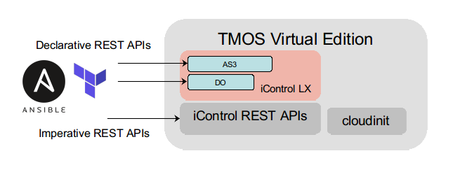
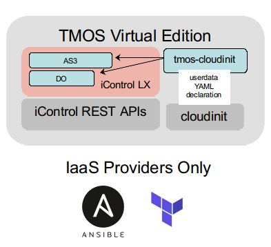

# tmos-cloudinit

[From TMOS Virtual Edition to a TMOS Cloud Virtual Machine](#cloudinit-modules-and-patching-for-f5--tmos)

- [Patching TMOS Virtual Edition Images to Install Cloudinit Modules](#patching-tmos-virtual-edition-images-to-install-cloudinit-modules)

  - [Creating Custom Cloud Cloudinit Config Templates](#creating-custom-cloud-cloudinit-config-templates)
  - [Patched Image Uploaders](#patched-image-uploaders)

- [Creating OpenStack Formatted Cloudinit ConfigDrive ISOs (Optional)](#creating-openstack-formatted-cloudinit-configdrive-isos)

[Using F5 TMOS Cloudinit Modules](#using-f5-tmos-cloudinit-modules)

- [Which Cloudinit Module To Use](#which-cloudinit-module-to-use)
- [The `tmos_static_mgmt` Cloudinit Module](#the-tmos_static_mgmt-cloudinit-module)
- [The `tmos_declared` Cloudinit Module](#the-tmos_declared-cloudinit-module)
- [The `tmos_configdrive_openstack` Cloudinit Module](#the-tmos_configdrive_openstack-cloudinit-module)
- [The `tmos_dhcpv4_tmm` Cloudinit Module](#the-tmos_dhcpv4_tmm-cloudinit-module)

[TMOS Cloudinit Modules Support for SSH Keys and Passwords](#tmos-cloudinit-modules-support-for-ssh-keys-and-passwords)

## From TMOS Virtual Edition to a TMOS Cloud Virtual Machine

F5 TMOS is a secured operating system designed for deployment as a network appliance. While TMOS utilizes a CentOS-based kernel and linux-based control processes to bootstrap and configure distributed networking micro-kernels, it is highly customized compared to generalized linux distributions.

Linux distributions create cloud editions of their distributions which include a standard bootstrapping agent known as `cloudinit` to integrate cloud infrastructure metadata with the regular system's init processes.

Starting with TMOS v13, TMOS also includes a version of cloudinit, but due to TMOS customizations, only the following standard cloudinit modules were enabled:

- bootcmd
- write_file
- runcmd

Through the use of these cloudinit modules, various combinations of `bash`, `javascript`, and `python` onboard scripting were used by F5 to tailor TMOS Virtual Edition to specific cloud infrastructures, like AWS, Azure, GCP, and OpenStack. Naitive onboarding templates were created for these IaaS environments. The templates created the necessary provisioning scripts to glean instance metadata from sources unique to each IaaS environment. The templates were highly coupled to the version of the IaaS APIs being deployed.

In an effort to standardize TMOS orchestration across clouds and in physical infrastructures, F5 created a service framework capable of extending the control plane APIs offered by TMOS. This framework, called iControl LX, provides a way to extend TMOS native REST APIs with onboarding workflows written in Javascript. F5 pusblishes supported iControl LX extensions that provide base TMOS system provisioning (f5-declarative-onboaring) and TMM service provisioning (f5-appsvcs-extension) as a way of making service catalog easy to compose in any IaaS environment. These and other F5 supported extensions make up the F5 Automation and Orchestration (A & O) toolchain.



The cloudinit modules found in this repository unify TMOS cloudinit agent declarations with the F5 Automation and Orchestration (A & O) toolchain iControl LX extension declarations. The same advanced functionality provided by the F5 Automation and Orchestration toolchain declarations become available via industry standard `cloudinit` userdata declarations. This reduces the need to learn and support separate TMOS orchestration modules to only utilizing the orchestrator's support for `cloudinit` on compute instances. TMOS Virtual Edition is transitioned into a cloud ready immutable infrastrucutre component.



Each of the tmos-cloudinit modules supports the publishing and installation of iControl LX extensions for use in TMOS orchestration. This decouples the version of TMOS Virtual Edition from specific iControl LX extension functionality.

The `tmos_static_mgmt` cloudinit module extends TMOS Virtual Edition deployments to environments that do not support DHCP for the management interface.

The `tmos_dhcpv4_tmm` cludinit module extends TMOS Virtual Edition to support DHCPv4 provisioning of TMM data plane interfaces. Addition `f5-declarative-onboarding` and `f5-appsvcs-extention` extension declarations attributes are merged with the DHCPv4 provisioned attributes.

The `tmos_configdrive_openstack` coudinit module extends TMOS Virtual Edition to provision link layer, IP layer, DNS, and NTP services from standard OpenStack `network_data.json` metadata. Addition `f5-declarative-onboarding` and `f5-appsvcs-extention` extension declarations attributes are merged with the `network_data.json` provisioned attributes.

The `tmos_declared` cloudinit module simply declares `f5-declarative-onboarding` and `f5-appsvcs-extention` extension declarations from userdata YAML.

The cloudinit modules included in this repository need to be file-injected into standard TMOS v13+ images before they can be used.

## Patching TMOS Virtual Edition Images to Install Cloudinit Modules

In order to use the cloudinit modules from this repository, standard TMOS Virtual Edition images need to be patched to include the modules and optionally include the installation packages for any F5 Automation and Orchestration iControl LX extensions.

This repository includes a Dockerfile and patch scripts that enable you to build a Docker instance capable of patching standard TMOS Virtual Edition images from `downloads.f5.com` so that they will include this repositories' cloudinit modules and optionally iControl LX extensions.

From the F5 Downloads site, download all image(s) you wish to patch with these cloudinit modules to a directory available as a volume mount to your docker instance (see mounts below).

```bash
ls /data/BIGIP-14.1
BIGIP-14.1.0.5-0.0.5.ALL_1SLOT-ide.ova
BIGIP-14.1.0.5-0.0.5.ALL_1SLOT.qcow2.zip
BIGIP-14.1.0.5-0.0.5.ALL_1SLOT-scsi.ova
BIGIP-14.1.0.5-0.0.5.ALL_1SLOT.vhd.zip
BIGIP-14.1.0.5-0.0.5.LTM_1SLOT-ide.ova
BIGIP-14.1.0.5-0.0.5.LTM_1SLOT-scsi.ova
BIGIP-14.1.0.5-0.0.5.LTM_1SLOT.qcow2.zip
BIGIP-14.1.0.5-0.0.5.LTM_1SLOT.vhd.zip
```

You can also prepare a directory that contains any iControl LX extension package `rpm` files that you wish to inject into your image. These packages are installed at boot time when any of the `tmos-cloudinit` modules are enabled.

```bash
ls /data/iControlLXLatestBuild
f5-appsvcs-3.11.0-3.noarch.rpm
f5-declarative-onboarding-1.4.0-1.noarch.rpm
```

### Note: do not remove the disk images from their archive containers (zip or ova). The utilities in the container do that as part of the image patching process

Build the docker image from the `tmos_image_patcher` Dockerfile.

```bash
docker build -t tmos_image_patcher:latest tmos_image_patcher
```

This will download a vanilla Ubuntu 18.04 container, install all the necessary open source utilities required to patch TMOS images, and designate the python script which performs the image patching as the execution entry point for the container image.

After the build completes, a docker image will be available locally.

```bash
docker images | grep tmos_image_patcher
tmos_image_patcher    latest    3416ed456cfe    22 seconds ago    1.38GB
```

Patched images can then be built by running a `tmos_image_builder` docker container instance with the correct volume mounts and `image_patch_file` directory structure defined.

The `tmos_image_builder` container uses open source tools to:

- decompress the downloaded TMOS image archive for all archives found in the `/TMOSImages` volume mount (see mounts below) directory
- bind the TMOS disk image partitions
- mount the logical volumes for `/config`, `/usr`, `/var`, and `/shared` from the bound TMOS file systems
- copies files specified in the `image_path_files` file directory structure into the TMOS image
  - the `system_python_path` is a special designation which will resolve the correct TMOS version's python system path directory and inject files to the resolved directory
- copies all iControl LX extension `rpm` files mounted in the `/iControlLXPackages` volume mount (see mounts below) direcotry to the `/shared/rpms/icontrollx_installs` TMOS directory, ready for installation when any of the `tmos_cloudinit` modules are enabled
- creates a distribution archive ready for upload to your virtualization image storage services

When you run the `tmos_image_patcher` container from this repository's root directory, it will find the `image_path_files` directory structure and patch your images with the files found within. This repository's `image_path_files` directory structure is designed to inject all four of `tmos-cloudinit` modules and patch the `cloud-init` configuration file template to load the `tmos-cloudinit` modules properly when TMOS boots.

The open source tools used in the container are all user space utilities, thus the container requires no special privileges other then write access to the directory where your downloaded TMOS disk archives are mounted (`/TMOSImages` see below).

#### Expected Docker Volume Mounts for the `tmos_image_builder` Container

The docker container uses the mount points listed below. Your TMOS image archives folder should be mounted as a volume to the container's `/TMOSImages` directory. Any iControl LX extensions `rpm` packages you want injected into your image should be mounted to the container's `/iControlLXPackages` directory.

| Docker Volume Mount | Required | Description |
| --------------------- | ----- | ---------- |
| /TMOSImages   | Yes | Path to the directory with the TMOS Virtual Edition archives to patch |
| /iControlLXPackages   | No | Path to the directory with optional iControl LX RPM packages to inject into the images |

#### Example Mounts

`
-v /data/BIGIP-14.1:/TMOSImages -v /data/iControlLXLatestBuild:/iControlLXPackages
`

You can run the image patch script with the Docker `run` command.

```bash
docker run --rm -it -v /data/BIGIP-14.1:/TMOSImages -v /data/iControlLXLatestBuild:/iControlLXPackages tmos_image_patcher:latest

2019-05-29 22:43:48,133 - tmos_image_patcher - DEBUG - process start time: Wednesday, May 29, 2019 10:43:48
2019-05-29 22:43:48,133 - tmos_image_patcher - INFO - Scanning for images in: /TMOSImages
2019-05-29 22:43:48,133 - tmos_image_patcher - INFO - TMOS cloudinit modules sourced from: /tmos-cloudinit
2019-05-29 22:43:48,133 - tmos_image_patcher - INFO - Copying iControl LX install packages from: /iControlLXPackages
2019-05-29 22:43:48,133 - tmos_image_patcher - INFO - Patching TMOS /usr file system from: /tmos-cloudinit/image_patch_files/usr
2019-05-29 22:43:48,133 - tmos_image_patcher - DEBUG - extracting /TMOSImages/BIGIP-14.1.0.5-0.0.5.ALL_1SLOT.vhd.zip to /TMOSImages/BIGIP-14.1.0.5-0.0.5.ALL_1SLOT.vhd
2019-05-29 22:44:41,790 - tmos_image_patcher - DEBUG - extracting /TMOSImages/BIGIP-14.1.0.5-0.0.5.LTM_1SLOT.vhd.zip to /TMOSImages/BIGIP-14.1.0.5-0.0.5.LTM_1SLOT.vhd
2019-05-29 22:45:41,653 - tmos_image_patcher - DEBUG - extracting /TMOSImages/BIGIP-14.1.0.5-0.0.5.LTM_1SLOT-ide.ova to /TMOSImages/BIGIP-14.1.0.5-0.0.5.LTM_1SLOT-ide
...

```

Each TMOS image archive will be expanded into a folder containing the patched image. The folder will have the same name as the archive file without the extension. The patched image, in the expanded folder, will be in the same format as the original. You can utilize the patched images just as you would the originals.

MD5 checksum files will be produced for each image.

```bash
tree /data/BIGIP-14.1
/data/BIGIP-14.1
├── BIGIP-14.1.0.5-0.0.5.ALL_1SLOT-ide.ova
├── BIGIP-14.1.0.5-0.0.5.ALL_1SLOT-ide
│   └── BIGIP-14.1.0.5-0.0.5.ALL_1SLOT-ide.ova
|   └── BIGIP-14.1.0.5-0.0.5.ALL_1SLOT-ide.ova.md5
├── BIGIP-14.1.0.5-0.0.5.ALL_1SLOT.qcow2.zip
├── BIGIP-14.1.0.5-0.0.5.ALL_1SLOT.qcow2
│   └── BIGIP-14.1.0.5-0.0.5.qcow2
|   └── BIGIP-14.1.0.5-0.0.5.qcow2.md5
├── BIGIP-14.1.0.5-0.0.5.ALL_1SLOT-scsi.ova
├── BIGIP-14.1.0.5-0.0.5.ALL_1SLOT-scsi
│   └── BIGIP-14.1.0.5-0.0.5.ALL_1SLOT-scsi.ova
│   └── BIGIP-14.1.0.5-0.0.5.ALL_1SLOT-scsi.ova.md5
├── BIGIP-14.1.0.5-0.0.5.ALL_1SLOT.vhd.zip
├── BIGIP-14.1.0.5-0.0.5.ALL_1SLOT.vhd
│   └── BIGIP-14.1.0.5-0.0.5.vhd
│   └── BIGIP-14.1.0.5-0.0.5.vhd.md5
├── BIGIP-14.1.0.5-0.0.5.LTM_1SLOT-ide.ova
├── BIGIP-14.1.0.5-0.0.5.LTM_1SLOT-ide
│   └── BIGIP-14.1.0.5-0.0.5.LTM_1SLOT-ide.ova
│   └── BIGIP-14.1.0.5-0.0.5.LTM_1SLOT-ide.ova.md5
├── BIGIP-14.1.0.5-0.0.5.LTM_1SLOT.qcow2.zip
├── BIGIP-14.1.0.5-0.0.5.LTM_1SLOT.qcow2
│   └── BIGIP-14.1.0.5-0.0.5.qcow2
│   └── BIGIP-14.1.0.5-0.0.5.qcow2.md5
├── BIGIP-14.1.0.5-0.0.5.LTM_1SLOT-scsi.ova
├── BIGIP-14.1.0.5-0.0.5.LTM_1SLOT-scsi
│   └── BIGIP-14.1.0.5-0.0.5.LTM_1SLOT-scsi.ova
│   └── BIGIP-14.1.0.5-0.0.5.LTM_1SLOT-scsi.ova.md5
├── BIGIP-14.1.0.5-0.0.5.LTM_1SLOT.vhd.zip
├── BIGIP-14.1.0.5-0.0.5.LTM_1SLOT.vhd
│   └── BIGIP-14.1.0.5-0.0.5.vhd
│   └── BIGIP-14.1.0.5-0.0.5.vhd.md5
```

A signed SHA384 digist file can optionally be generated for each patched image if you include a `/keys` volume mount to the directory containing your private signing key and an environment variable, `PRIVATE_PEM_KEY_FILE`, specifying the private key file.

```bash
docker run --rm -it -v /data/BIGIP-14.1:/TMOSImages -v /data/iControlLXLatestBuild:/iControlLXPackages -v /data/safe/keys:/keys -e PRIVATE_PEM_KEY_FILE=j.gruber_f5.rsa.private tmos_image_patcher:latest
```

Once patched, your TMOS images can be uploaded for use in your infrastructure environment by using the native client tools.

As an example, for an an OpenStack private cloud, the patched images can be uploaded with the `openstack` cli tool.

```bash
openstack image create --disk-format qcow2 --container-format bare --file /data/BIGIP-14.1/BIGIP-14.1.0.5-0.0.5.LTM_1SLOT.qcow2/BIGIP-14.1.0.5-0.0.5.qcow2 OpenStack_BIGIP-14.1.0.5-0.0.5.LTM_1SLOT
+------------------+------------------------------------------------------+
| Field            | Value                                                |
+------------------+------------------------------------------------------+
| checksum         | 4929021d0f045eb91f928f4cf26aeca9                     |
| container_format | bare                                                 |
| created_at       | 2019-05-29T23:23:29Z                                 |
| disk_format      | qcow2                                                |
| file             | /v2/images/c8692af7-66a7-4dd0-8b0a-81506b0b3b74/file |
| id               | c8692af7-66a7-4dd0-8b0a-81506b0b3b74                 |
| min_disk         | 0                                                    |
| min_ram          | 0                                                    |
| name             | OpenStack_BIGIP-14.1.0.5-0.0.5.LTM_1SLOT             |
| owner            | 14910e1a2ed544f7aef81c5019d43f4a                     |
| protected        | False                                                |
| schema           | /v2/schemas/image                                    |
| size             | 5069668352                                           |
| status           | active                                               |
| tags             |                                                      |
| updated_at       | 2019-05-29T23:24:14Z                                 |
| virtual_size     | None                                                 |
| visibility       | shared                                               |
+------------------+------------------------------------------------------+

```

Once your patched images are deployed in your virtualized environment, you can use cloudinit userdata to handle initial device and service provisioning.

## Creating Custom Cloud Cloudinit Config Templates

By default the TMOS cloudinit config adds all the `tmos-cloudinit` modules required and allows TMOS to decide the cloudinit datasource. If you cloud does not work with the TMOS default datasources for your detected environment, the TMOS cloudinit config template can be changed to support your environments requirements. You should not attempt to do this if you are not familiar with your environment's cloudinit support or the way TMOS configures cloudinit.

To specifiy a custom TMOS cloudinit config, specify the `TMOS_CLOUDINIT_CONFIG_TEMPLATE` environment variable for your container run. As an example, to specify the required TMOS cloudinit config for the IBM Public Cloud VPC Gen2, you would run you image patch container run including the environment variable `TMOS_CLOUDINIT_CONFIG_TEMPLATE` pointing to the containerized path of the `cloud-init.tmpl` file.

```bash
docker run --rm -it -v [local path to TMOS qcow.zip files]:/TMOSImages -v [local path to iControl LX rpm files]:/iControlLXPackages -e TMOS_CLOUDINIT_CONFIG_TEMPLATE=/tmos-cloudinit/image_patch_files/cloudinit_configs/ibmcloud_vpc_gen2/cloud-init.tmpl tmos_image_patcher:latest

```

## Patched Image Uploaders

Various uplaoders will be added to this project as infrastructure environments demand them.

All uploaders will take their required settings, such as login credentials and URL endpoints, via environment variables. The uploader containers take the same `TMOSImages` volume mount used to patch the images. All patched images found in the `TMOSImages` volume will be uploaded to the given environment.

An OpenStack Uploader in included.

### Building the OpenStack Uploader

```bash
docker build --rm -t openstack_image_uploader:latest openstack_image_uploader
```

### Uploading Patched Images to OpenStack

Source your OpenStack RC file, putting the require environment variables into your shell environment. These environment variables are then presented as to the `openstack_image_uploader` container with Docker environment variables.

```bash
docker run --rm -it -v /data/BIGIP-14.1:/TMOSImages -e OS_USERNAME=$OS_USERNAME -e OS_PASSWORD=$OS_PASSWORD -e OS_AUTH_URL=$OS_AUTH_URL openstack_image_uploader:latest
```

The OpenStack uploader will find md5, and optionally image signatures, and add them with the appropriate image shade metadata.

### IBM Public Cloud

To create customer IBM Public Cloud VPC Gen2 TMOS images there is a two step workflow:

1. Upload the patched TMOS image to IBM COS (cloud object storage)
2. Create a VPC Gen2 custom image from the IBM COS image SQL URL

Both of these steps have their own docker container tools with their own documentation.

[Upload Patched Image to IBM COS](./ibmcloud_image_uploader)

[Create a VPC Gen2 custom image](./ibmcloud_vpc_image_importer)

## Creating OpenStack Formatted Cloudinit ConfigDrive ISOs

While IaaS clouds already support mechanisms to supply cloudinit userdata to declare guest instances configurations, some virtualization environments do not. For those environments, an ISO CDROM image can be attached to TMOS Virtual Edition guests prior to initial booting. If the ISO image is formatted as a cloudinit ConfigDrive data source, cloudinit modules can still be used, even when the virtualization environment does not directly support it.

As an example, VMWare Workstation can be use to deploy a TMOS Virtual Edition instance from a patched OVA archive. Prior to starting the instance, the user can add an IDE CDROM drive device and connect a ConfigDrive ISO file which contains their userdata declaration.

TMOS supports cloudinit OpenStack ConfigDrive. The ISO CDROM attached needs to have a volume label of `config-2` and must follow a specific layout of files, containing a specific JSON file with a specific attribute defined.

```bash
/iso (volume label config-2)
└── openstack
    └── latest
        ├── meta_data.json
        ├───────────────────> {"uuid": "a7481585-ee3f-432b-9f7e-ddc7e5b02c27"}
        ├── user_data
        └───────────────────> THIS CAN CONTAIN ANY USERDATA YOU WANT
```

If you generate an ISO9660 filesystem with Rock Ridge extensions to allow TMOS cloudinit to mount your device and act on your userdata, you can treat any virtualization environment like a properly declared IaaS. You can use any ISO9660 filesystem generation tool you want, as long as it conforms to the standard for the OpenStack ConfigDrive cloudinit data source.

This repository includes a Dockerfile and an ISO9660 generation script, called `tmos_configdrive_builder`, which will build the CDROM ISO image file with your customized inputs.

You can build the docker image from the `tmos_configdrive_builder` Dockerfile.

```bash
docker build -t tmos_configdrive_builder:latest tmos_configdrive_builder
```

This will use an generic Ubuntu 18.04 image, install all the necessary tools to create ISO image, and designate the python script which creates the ISO image as the execution entry point for the container image.

After the build process completes, a docker image will be available locally.

```bash
docker images|grep tmos_configdrive_builder
tmos_configdrive_builder     latest     23c1d99efdd5     17 seconds ago     274MB
```

The script takes inputs as environment variables instead of command line arguments.  Content, like your declarations or JSON dictionaries, are made available via files in specific directories. Docker consumes these via volume mounts.

The CDROM is built to be used in two modes:

1. `tmos_declared` mode - this mode builds f5-declarative-onboarding and, optionally, f5-appsvcs-extensions declarations, `phone_home_url`, and `phone_home_cli` variables, into a CDROM ISO usable with the `tmos_declared` cloudinit module.

2. Fully explicit mode - this mode builds a CDROM ISO from a fully defined set of `user_data`, and optionally `meta_data.json`, `vendor_data.json`, and `network_data.json` files. This allows for the construction of any settings in your `user_data` you want. This can be used to work with any of the modules defined in this repository.

### tmos_declared Mode Environment Variables and Files

The following environment variables determine how the CDROM ISO is built:

| Environment Variable | Required | Default | Description|
| --------------------- | ----- | ---------- | ---------------|
| DO_DECLARATION_FILE   | Yes | /declarations/do_declaration.json | Your f5-declarative-onboarding declaration in a text file. The declaration can be in JSON or YAML format. |
| TS_DECLARATION_FILE  | No | /declarations/ts_declaration.json | Your f5-telemetry-streaming declaration in a text file. The declaration can be in JSON or YAML format. |
| AS3_DECLARATION_FILE  | No | /declarations/as3_declaration.json | Your f5-appsvcs-extension declaration in a text file. The declaration can be in JSON or YAML format. |
| PHOME_HOME_URL | No | None | The URL to use as the `phone_home_url` attributed of the `tmos_declared` declaration. |
| PHOME_HOME_CLI | No | None | The URL to use as the `phone_home_url` attributed of the `tmos_declared` declaration. |
| CONFIGDRIVE_FILE | Yes | /configdrives/configdrive.iso | The output ISO file. |

The files specified above must be available to the Docker instance, and need to be mounted as volumes by the Docker instance.

Example: If you have a local subfolder `declarations` directory containing both `do_declaration.json` and `as3_declaration.json`, you could create your basic CDROM ISO in the current directory using the following bash shell command.

```bash
docker run --rm -it -v $(pwd)/declarations:/declarations -v $(pwd):/configdrives tmos_configdrive_builder
2019-05-30 20:00:59,009 - tmos_image_patcher - INFO - building ISO9660 for tmos_declared module with declarations
2019-05-30 20:00:59,029 - tmos_image_patcher - INFO - adding f5-declarative-onboarding declaration to user_data
2019-05-30 20:00:59,029 - tmos_image_patcher - INFO - adding f5-appsvcs-extensions declaration to user_data
2019-05-30 20:00:59,042 - tmos_image_patcher - INFO - generating OpenStack mandatory ID
2019-05-30 20:00:59,046 - tmos_image_patcher - INFO - output IS09660 file: /configdrives/configdrive.iso
ls ./configdrive.iso
configdrive.iso
```

To define `phone_home_url` or `phone_home_cli` attributes in your `tmos_declared` declaration, specify them as Docker environment variables.

#### Expected Docker Volume Mounts

The configdrive ISO builder script expects two mount points. One is a file path to your declarations, either default or explicitly defined by Docker environment variables. The other is the directory to write your ISO file.

| Docker Volume Mount | Required | Description |
| --------------------- | ----- | ---------- |
| /declarations   | Yes | Path to the directory containing your declarations |
| /configdrives   | Yes | Path to the directory to write your ISO files |

Example: to create a `configdrive.iso` file in the current directory which would create metadata for the `tmos_declared` cloudint module, using declaration files from the `./declarations` directory, while explicitly defining a `phone_home_url`, the Docker `run` syntax would look like the following.

```bash
docker run --rm -it -e PHONE_HOME_URL=https://webhook.site/5f8cd8a7-b051-4648-9296-8f6afad34c93 -v $(pwd)/declarations:/declarations -v $(pwd):/configdrives tmos_configdrive_builder
```

#### Explicit Mode Environment Variables and Files

If the script has a `USERDATA_FILE` or finds a `/declarations/user_data` file, it will automatically prefer explicit mode.

The other defined optional files `METADATA_FILE`, `VENDORDATA_FILE`, and `NETWORKDATA_FILE`, should conform to the OpenStack metadata standards for use with cloudinit.

| Environment Variable | Required | Default | Description|
| --------------------- | ----- | ---------- | ---------------|
| USERDATA_FILE   | Yes | /declarations/user_data | Your fully defined user_data to include. See Using F5 TMOS Cloudinit Modules below. |
| METADATA_FILE   | No | /declarations/meta_data.json | Your fully defined instance meta_data to include in JSON format. |
| VENDOR_FILE   | No | /declarations/vendor_data.json | Your fully defined instance vendor_data to include in JSON format. |
| NETWORKDATA_FILE   | No | /declarations/network_data.json | Your fully defined instance network_data to include in JSON format. |
| CONFIGDRIVE_FILE | Yes | /configdrives/configdrive.iso | The output ISO file. |

```bash
docker run --rm -it -e USERDATA_FILE=/declarations/instance2224 -v $(pwd)/declarations:/declarations -v $(pwd):/configdrives tmos_configdrive_builder
2019-05-30 20:04:12,158 - tmos_image_patcher - INFO - building ISO9660 configdrive user_data from /declarations/instance2224
2019-05-30 20:04:12,158 - tmos_image_patcher - INFO - generating OpenStack mandatory ID
2019-05-30 20:04:12,163 - tmos_image_patcher - INFO - output IS09660 file: /configdrives/configdrive.iso
ls ./configdrive.iso
configdrive.iso
```

## Using F5 TMOS Cloudinit Modules

F5 TMOS cloudinit modules each include an `enabled` attribute which must be set to `true` for any onboard configuration to take place. For the most part, these modules are mutually exclusive, meaning you should only use the one that fits your deployment environment.

All modules log to the common `/var/log/f5-cloudinit.log` log file on the TMOS Virtual Edition instance.

### Which Cloudinit Module To Use

Each module handles very specific use cases. Each use case aquires the per-instance configuration data from different resources.

| Module | Aquires Per-Instance Config From | Provisions |
| --------------------- | ----------------- | ---------- |
| tmos_static_mgmt   | cloudinit YAML declaration | Provisions the management interface statically from cloudinit YAML, and then optionally installs iControl LX extensions. |
| tmos_declared   | cloudinit YAML declaration | Optionally installs iControl LX extensions and then makes f5-declarative-onboarding and f5-appsvcs-extention declarations. |
| tmos_configdrive_openstack  | OpenStack metadata, and cloudinit YAML declaration | Provisions the management interface from OpenStack metadata, then optionally installs iControl LX extensions. An f5-declarative-onboarding declaration is constructed from OpenStack metadata. Any f5-declarative-onboarding declaration made in the cloudinit YAML is merged with the declaration created from OpenStack metadata. Any attributes defined in the declaration in the cloud YAML overwrites any attribute constructed from the OpenStack metadata. After f5-declarative-onboarding is complete, optionally an f5-appsvcs-extension declaration from the cloudinit YAML delcaration is made. |
| tmos_dhcpv4_tmm   | DHCPv4 requests on all interfaces, and cloudinit YAML declaration | Provisions the management interface from DHCPv4 lease information, then optionally installs iControl LX extensions. An f5-declarative-onboarding declaration is constructed from DHCPv4 lease information. Any f5-declarative-onboarding declaration made in the cloudinit YAML is merged with the declaration created from DHCPv4 lease information. Any attributes defined in the declaration in the cloud YAML overwrites any attributes constructed from DHCPv4 information. After f5-declarative-onboarding is complete, optionally an f5-appsvcs-extension declaration from the cloudinit YAML delcaration is made.|

You should use the module which matches your sources of per-instance configuration data.

## The tmos_static_mgmt Cloudinit Module

This cloudinit module extends TMOS Virtual Edition to allow for static address assignment provided through cloudinit userdata.

This modules create initialization scripts containing `tmsh` commands to fulfill the specified configurations. The generated initialization scripts are created in the `/opt/cloud/tmos_static_mgmt` directory on the TMOS device.

| Module Attribute | Default | Description|
| --------------------- | -----------| ---------------|
| enabled              | false      | Activates ths module|
| ip         | none (required)        | The management IP address or CIDR. |
| netmask | none | The management IP netmask, only required if the IP is not CIDR. |
| gw | none | The management default gateway IP address. |
| mtu | 1500 | The management link MTU. |
| hostname | none | The hostname in FQDN format (host and domain) to assign. |
| nameservers | list | List of DNS server IP addresses. |
| searchdomain | none | A single search domain to assign. |
| ntpservers | list | List of NTP server FQDNs or IP addresses. |
| icontrollx_trusted_sources | true | Only install iControl LX RPMs which are signed by TMOS trusted keys. |
| icontrollx_package_urls | none | List of URLs to download and install iControl LX extension packages before onboarding. |
| post_onboard_enabled | false | Enabled the attempt to run a list of commands after onboarding completes. |
| post_onboard_commands | list | List of CLI commands to run in order. Execution will halt at the point a CLI command fails. |
| phone_home_url | url | Reachable URL to report completion of this modules onboarding. |
| phone_home_url_verify_tls | true | If the phone_home_url uses TLS, verify the host certificate. |
| phone_home_cli | cli command | CLI command to run when this modules completes successfully. |

### Note: The `tmos_static_mgmt` module can be used in conjunction with the `tmos_declared` module to add managment interface provisioning before iControl LX extension declarations are made

#### tmos_static_mgmt userdata usage

```yaml
#cloud-config
tmos_static_mgmt:
  enabled: true
  ip: 192.168.245.100
  netmask: 255.255.255.0
  gw: 192.168.245.1
  mtu: 1450
  icontrollx_trusted_sources: false
  icontrollx_package_urls:
    - https://github.com/F5Networks/f5-declarative-onboarding/raw/master/dist/f5-declarative-onboarding-1.3.0-4.noarch.rpm
    - https://github.com/F5Networks/f5-appsvcs-extension/raw/master/dist/latest/f5-appsvcs-3.10.0-5.noarch.rpm
    - https://github.com/F5Networks/f5-telemetry-streaming/raw/master/dist/f5-telemetry-1.2.0-1.noarch.rpm
  post_onboard_enabled: true
  post_onboard_commands:
    - tmsh modify sys db ui.advisory.color { value orange }
    - tmsh modify sys db ui.advisory.text { value  'Onboarded with OpenStack Metadata' }
    - tmsh modify sys db ui.advisory.enabled { value true }
    - tmsh modify sys db provision.extramb { value 500 }
    - tmsh modify sys global-settings gui-setup disabled
    - tmsh modify sys provision ltm level minimum
    - tmsh modify sys provision asm level minimum
    - /usr/local/bin/SOAPLicenseClient --basekey KALCE-AHJBL-RFJSD-GGNFG-MFJCDYX
  phone_home_url: https://webhook.site/5f8cd8a7-b051-4648-9296-8f6afad34c93
  phone_home_cli: "curl -i -X POST -H 'X-Auth-Token: gAAAAABc5UscwS1py5XfC3yPcyN8KcgD7hYtEZ2-xHw95o4YIh0j5IDjAu9qId3JgMOp9hnHwP42mYA7oPPP0yl-OQXvCaCS3OezKlO7MsS-ZCTJzuS3sSysIMHTA78fGsXbMgCQZCi5G-evLG9xUNrYp5d3blhMnpHR0dlHPz6VMacNkPhyrQI' -H 'Content-Type: application/json' -H 'Accept: application/json' http://192.168.0.121:8004/v1/d3779c949b57403bb7f703016e91a425/stacks/demo_waf/3dd6ce45-bb8c-400d-a48c-87ac9e46e60e/resources/wait_handle/signal"
```

## The tmos_declared Cloudinit Module

This module assumes the management interface provisioning completes via the default method (DHCPv4 or DHCPv6), but that all other onboard configurations should be handled through f5-declarative-onboarding and f5-appsvcs-extension declarations.

### Warning: DHCPv6 does not include interface-mtu support, meaning access to your management interface might not be reliable. IPv6 requires the mgmt interface be set to a minimum of 1280 bytes, but SDN tunnel types might limit it to below the standard 1500 bytes. Use the `tmos_static_mgmt` in your cloudinit YAML if you need to provision your management interface to make it accessible

The declarations must be coherent with the deployment environment. As an example, the f5-declarative-onboarding declaration would need to include the `internal` VLAN and the `self_1nic` SelfIP classes to properly declare a 1NIC deployment.

This cloudinit module optionally composes f5-declarative-onboarding declarations in the `/var/lib/cloud/f5-declarative-onboarding` directory on TMOS. This declaration is in JSON format.

This cloudinit module optionally composes f5-appsvcs-extension declarations in the `/var/lib/cloud/f5-appsvcs-extension` directory on the TMOS. This declaration is in JSON format.

| Module Attribute | Default | Description|
| --------------------- | -----------| ---------------|
| enabled              | false      | Activates ths module|
| icontrollx_trusted_sources | true | Only install iControl LX RPMs which are signed by TMOS trusted keys |
| icontrollx_package_urls | none | List of URLs to download and install iControl LX extension packages before onboarding |
| do_declaration | none |  YAML formatted f5-declarative-onboarding declaration. This declaration will augment or overwrite the declaration created by resource discovery |
| do_declaration_url | none | Download URL for f5-declarative-onboarding declaration in YAML or JSON format. This declaration will augment or overwrite the declaration created by resource discovery |
| do_template_variables | none | A dictionary of variable names and values which will be used as jinja2 template variable replacements in the downloaded document found in the do_declaration_url. |
| as3_declaration | none | YAML formatted f5-appsvcs-extension declaration to declare if enabled |
| as3_declaration_url | none | Download URL for f5-appsvcs-extension declaration in YAML or JSON format to declared if enabled |
| as3_template_variables | none | A dictionary of variable names and values which will be used as jinja2 template variable replacements in the downloaded document found in the as3_declaration_url. |
| ts_declaration | none | The f5-telemetry-streaming declaration to decare if enabled |
| ts_declaration_url | none | Download URL for f5-telemetry-streaming declaration in YAML or JSON format to declared if enabled |
| ts_template_variables | none | A dictionary of variable names and values which will be used as jinja2 template variable replacements in the downloaded document found in the ts_declaration_url. |
| phone_home_url | url | Reachable URL to report completion of this modules onboarding. |
| phone_home_url_verify_tls | true | If the phone_home_url uses TLS, verify the host certificate. |
| phone_home_cli | cli command | CLI command to run when this modules completes successfully. |

When both `do_declaration` and `do_declaration_url` are defined, the JSON document at `do_declaration_url` will be downloaded then the entries in the `do_declaration` will overwrite entries in downloaded document. This enables generalized onboarding entries to used from the downloaded document and instance specific entries to be use from the instance declaration.

The `do_template_variables`, `as3_template_variables`, and `ts_template_variables` dictionaries will on work on TMOS version 15.1 and higher.

### Note: It is often simplier to use the `set-password` cloudinit module (referenced below) to change the default `admin` and `root` passwords rather than the f5-declarative-onboarding declaration to change user passwords. Both ways work as designed

#### tmos_declared userdata usage

```yaml
#cloud-config
tmos_declared:
  enabled: true
  icontrollx_trusted_sources: false
  icontrollx_package_urls:
    - "https://github.com/F5Networks/f5-declarative-onboarding/raw/master/dist/f5-declarative-onboarding-1.3.0-4.noarch.rpm"
    - "https://github.com/F5Networks/f5-appsvcs-extension/raw/master/dist/latest/f5-appsvcs-3.10.0-5.noarch.rpm"
    - "https://github.com/F5Networks/f5-telemetry-streaming/raw/master/dist/f5-telemetry-1.2.0-1.noarch.rpm"
  do_declaration:
    schemaVersion: 1.0.0
    class: Device
    async: true
    label: Cloudinit Onboarding
    Common:
      class: Tenant
      provisioningLevels:
        class: Provision
        ltm: nominal
        asm: nominal
      poolLicense:
        class: License
        licenseType: licensePool
        bigIqHost: licensor.example.openstack.com
        bigIqUsername: admin
        bigIqPassword: admin
        licensePool: BIGIPVEREGKEYS
        reachable: true
        bigIpUsername: admin
        bigIpPassword: admin
      dnsServers:
        class: DNS
        nameServers:
          - 8.8.8.8
        search:
          - example.openstack.com
      ntpServers:
        class: NTP
        servers:
          - 0.pool.ntp.org
          - 1.pool.ntp.org
          - 2.pool.ntp.org
      HA:
        class: VLAN
        mtu: 1450
        interfaces:
          - name: 1.1
            tagged: false
      HA-self:
        class: SelfIp
        address: 1.1.1.106/24
        vlan: HA
        allowService: all
        trafficGroup: traffic-group-local-only
      configsync:
        class: ConfigSync
        configsyncIp: /Common/HA-self/address
      internal:
        class: VLAN
        mtu: 1450
        interfaces:
          - name: 1.2
            tagged: false
      internal-self:
        class: SelfIp
        address: 192.168.40.51/24
        vlan: internal
        allowService: default
        trafficGroup: traffic-group-local-only
      external:
        class: VLAN
        mtu: 1450
        interfaces:
          - name: 1.3
            tagged: false
      external-self:
        class: SelfIp
        address: 192.168.80.56/24
        vlan: external
        allowService: none
        trafficGroup: traffic-group-local-only
      default:
        class: Route
        gw: 192.168.80.1
        network: default
        mtu: 1500
      dbvars:
        class: DbVariables
        ui.advisory.enabled: true
        ui.advisory.color: orange
        ui.advisory.text: This device is under centralized management.
  ts_declaration:
    class: Telemetry
    schemaVersion: 1.0.0
    controls:
      class: Controls
      logLevel: debug
    Poller:
      class: Telemetry_System_Poller
      interval: 60
      enable: true
      trace: false
      allowSelfSignedCert: false
      host: localhost
      port: 8100
      protocol: http
    Beacon_Consumer:
      class: Telemetry_Consumer
      type: Generic_HTTP
      host: ingestion.ovr.prd.f5aas.com
      protocol: https
      port: 50443
      path: "/beacon/v1/ingest-telemetry-streaming"
      method: POST
      enable: true
      trace: false
      headers:
        - name: "grpc-metadata-x-f5-ingestion-token"
          value: "`>@/passphrase`"
      passphrase:
        cipherText: "h-qqdej587nnj8ikask431s-JtsPTjcposjikzKKJs78c91Auu65suAr="
  as3_declaration:
    class: ADC
    schemaVersion: 3.0.0
    label: ASM_VS1
    remark: ASM_VS1
    Sample_app_sec_01:
      class: Tenant
      HTTP_Service:
        class: Application
        template: http
        serviceMain:
          class: Service_HTTP
          virtualAddresses:
            - 192.168.80.51
          snat: auto
          pool: Pool1
          policyWAF:
            use: WAFPolicy
        Pool1:
          class: Pool
          monitors:
            - http
          members:
            - servicePort: 8001
              serverAddresses:
                - 10.10.10.143
            - servicePort: 8002
              serverAddresses:
                - 10.10.10.144
        WAFPolicy:
          class: WAF_Policy
          url: "https://raw.githubusercontent.com/f5devcentral/f5-asm-policy-template-v13/master/owasp_ready_template/owasp-no-autotune.xml"
          ignoreChanges: true
  post_onboard_enabled: true
  post_onboard_commands:
    - "echo 'curl -s http://monitors.internal.local/rebooted' >> /config/startup"
  phone_home_url: "https://webhook.site/5f8cd8a7-b051-4648-9296-8f6afad34c93"
  phone_home_cli: "curl -i -X POST -H 'X-Auth-Token: gAAAAABc5UscwS1py5XfC3yPcyN8KcgD7hYtEZ2-xHw95o4YIh0j5IDjAu9qId3JgMOp9hnHwP42mYA7oPPP0yl-OQXvCaCS3OezKlO7MsS-ZCTJzuS3sSysIMHTA78fGsXbMgCQZCi5G-evLG9xUNrYp5d3blhMnpHR0dlHPz6VMacNkPhyrQI' -H 'Content-Type: application/json' -H 'Accept: application/json' http://192.168.0.121:8004/v1/d3779c949b57403bb7f703016e91a425/stacks/demo_waf/3dd6ce45-bb8c-400d-a48c-87ac9e46e60e/resources/wait_handle/signal"
```

## The tmos_configdrive_openstack Cloudinit Module

This cloudinit module requries the use of a ConfigDrive data source and OpenStack file formatted meta_data.json and network_data.json metadata files. This module extends TMOS functionality to include static provisioning of all interfaces (management and TMM) via either network metadata or the use of DHCPv4. This interface includes the ability to augment the configuration data retrieved via metadata and DHCP with additional f5-declarative-onboarding and f5-appsvc-3 declarations. Any supplied f5-declarative-onboarding declarations will be overwritten or will be merged with configuration declarations defined via metadata resource resolution. This module supports both 1NIC and nNIC deployments.

There are implicit declarations of the TMM interfaces names to use for the data plane default route and the configuration synchronization interfaces. If these declarations are omitted, the module will attempt to assign them dynamically based on available network configuration data.

This module creates initialization scripts containing `tmsh` commands to fulfil the specified configurations. The generated initialization scripts will be created in the `/opt/cloud/tmos_configdrive_openstack` directory on the device.

This cloudinit module optionally composes f5-declarative-onboarding declarations in the `/var/lib/cloud/f5-declarative-onboarding` directory. This declaration is in JSON format.

Any attributes in the `do_declaration` attriute of the cloudinit YAML will be merged into the f5-declarative-onboarding declaration composed from OpenStack metadata. Any declaration attribute defined in the cloudinit YAML will overwrite the same attribute, if present, in the composed declaration.

This cloudinit module optionally composes f5-appsvcs-extension declarations in the `/var/lib/cloud/f5-appsvcs-extension` directory. This declaration is in JSON format.

| Module Attribute | Default | Description|
| --------------------- | -----------| ---------------|
| enabled              | false      | Activates ths module|
| rd_enabled         | true        | Automatically create route domains when needed |
| configsync_interface | 1.1 | Sets the TMM interface name to use for configsync |
| default_route_interface | none | Explicitly define the TMM interface to use for the default route. If unspecified, one will be determined automatically |
| dhcp_timeout | 120 | Seconds to wait for a DHCP response when using DHCP for resource discovery |
| inject_routes | true | Creates static routes from discovered route resources |
| icontrollx_trusted_sources | true | Only install iControl LX RPMs which are signed by TMOS trusted keys |
| icontrollx_package_urls | none | List of URLs to download and install iControl LX extension packages before onboarding |
| do_enable | true | Enables an attempt to create a f5-declarative-onboarding declaration from discovered resources. If enabled, an asynchronous attempt to declare resouces via f5-declarative-onboarding will be made. If the initial request fails, non-declarative onboarding will resumse |
| do_declaration | none |  YAML formatted f5-declarative-onboarding declaration. This declaration will augment or overwrite the declaration created by resource discovery |
| do_declaration_url | none | Download URL for f5-declarative-onboarding declaration in YAML or JSON format. This declaration will augment or overwrite the declaration created by resource discovery |
| do_template_variables | none | A dictionary of variable names and values which will be used as jinja2 template variable replacements in the downloaded document found in the do_declaration_url. |
| ts_enabled | true | Enables attempt to declare telemetry streaming configuration with f5-telemetry-streaming|
| ts_declaration | true | The f5-telemetry-streaming declaration to declare if enabled |
| ts_declaration_url | none | Download URL for f5-telemetry-streaming declaration in YAML or JSON format to declared if enabled |
| ts_template_variables | none | A dictionary of variable names and values which will be used as jinja2 template variable replacements in the downloaded document found in the ts_declaration_url. |
| as3_enabled | true | Enables attempt to declare an application services configuration with f5-appsvcs-extension|
| as3_declaration | none | The f5-appsvcs-extension declaration to declare if enabled |
| as3_declaration_url | none | Download URL for f5-appsvcs-extension declaration in YAML or JSON format to declared if enabled |
| as3_template_variables | none | A dictionary of variable names and values which will be used as jinja2 template variable replacements in the downloaded document found in the as3_declaration_url. |
| post_onboard_enabled | false | Enable the attempt to run a list of commands after onboarding completes |
| post_onboard_commands | list | List of CLI commands to run in order. Execution will halt at the point a CLI command fails. |
| phone_home_url | url | Reachable URL to report completion of this modules onboarding. |
| phone_home_url_verify_tls | true | If the phone_home_url uses TLS, verify the host certificate. |
| phone_home_cli | cli command | CLI command to run when this modules completes successfully. |

When both `do_declaration` and `do_declaration_url` are defined, the JSON document at `do_declaration_url` will be downloaded then the entries in the `do_declaration` will overwrite entries in downloaded document. This enables generalized onboarding entries to used from the downloaded document and instance specific entries to be use from the instance declaration.

The `do_template_variables`, `as3_template_variables`, and `ts_template_variables` dictionaries will on work on TMOS version 15.1 and higher.

### Warning: f5-declarative-onboarding and f5-appsvcs-extension do not support the use of route domains at this time. You should disable route domain support when attempting to use f5-declarative-onboarding and f5-appsvcs-extension declarations when using tmos_configdrive_openstack

SSH keys found in the OpenStack meta_data.json file will also be injected as authorized_keys for the root account.

If f5-declarative-onboarding is disabled, done by setting `do_enabled` to false, the device onboarding configuration will continue as described in the OpenStack meta_data.json and network_data.json files. f5-appsvcs-extension declarations can be applied with or without f5-declarative-onboarding being enabled.

#### tmos_configdrive_openstack userdata usage

```yaml
#cloud-config
tmos_configdrive_openstack:
  enabled: true
  rd_enabled: false
  configsync_interface: 1.1
  default_route_interface: 1.3
  dhcp_timeout: 120
  inject_routes: true
  icontrollx_trusted_sources: false
  icontrollx_package_urls:
    - https://github.com/F5Networks/f5-declarative-onboarding/raw/master/dist/f5-declarative-onboarding-1.3.0-4.noarch.rpm
    - https://github.com/F5Networks/f5-appsvcs-extension/raw/master/dist/latest/f5-appsvcs-3.10.0-5.noarch.rpm
    - https://github.com/F5Networks/f5-telemetry-streaming/raw/master/dist/f5-telemetry-1.2.0-1.noarch.rpm
  post_onboard_enabled: false
  do_enabled: true
  do_declaration:
    Common:
      class: Tenant
      licenseKey:
        class: License
        licenseType: regKey
        regKey: GJKDM-UJTJH-OJZVX-ZJPEG-XTJIAHI
      provisioningLevels:
        class: Provision
        ltm: nominal
        asm: minimum
  as3_enabled: true
  as3_declaration:
    class: AS3
    action: deploy
    persist: true
    declaration:
      class: ADC
      schemaVersion: 3.0.0
      ...
  phone_home_url: https://webhook.site/5f8cd8a7-b051-4648-9296-8f6afad34c93
  phone_home_cli: "curl -i -X POST -H 'X-Auth-Token: gAAAAABc5UscwS1py5XfC3yPcyN8KcgD7hYtEZ2-xHw95o4YIh0j5IDjAu9qId3JgMOp9hnHwP42mYA7oPPP0yl-OQXvCaCS3OezKlO7MsS-ZCTJzuS3sSysIMHTA78fGsXbMgCQZCi5G-evLG9xUNrYp5d3blhMnpHR0dlHPz6VMacNkPhyrQI' -H 'Content-Type: application/json' -H 'Accept: application/json' http://192.168.0.121:8004/v1/d3779c949b57403bb7f703016e91a425/stacks/demo_waf/3dd6ce45-bb8c-400d-a48c-87ac9e46e60e/resources/wait_handle/signal"
```

## The tmos_dhcpv4_tmm Cloudinit Module

This cloudinit module resolves configuration data for all interfaces (management and TMM) through DHCPv4. All interfaces should be connected to networks with DHCPv4 services. This module supports both 1NIC and nNIC deployments.

There are implicit declarations of the TMM inteface names to use for the data plane default route and the configuration synchronization interfaces. If these declarations are omitted, the module will attempt to assign them dynamically based on available network configuration data.

This module creates initialization scripts containing TMOS `tmsh` commands to fulfil the specified configurations. The generated initialization scripts are created in the `/opt/cloud/tmos_dhcpv4_tmm` directory on the device.

This cloudinit module optionally composes f5-declarative-onboarding declarations in the `/var/lib/cloud/f5-declarative-onboarding` directory. This declaration is in JSON format.

Any attributes in the `do_declaration` attribute of the cloudinit YAML will be merged into the f5-declarative-onboarding declaration composed from DHCPv4 lease information. Any declaration attribute defined in the cloudinit YAML will overwrite the same attribute, if present, in the composed declaration.

This cloudinit module optionally composes f5-appsvcs-extension declarations in the `/var/lib/cloud/f5-appsvcs-extension` directory. This declaration is in JSON format.

| Module Attribute | Default | Description|
| --------------------- | -----------| ---------------|
| enabled              | false      | Activates ths module|
| rd_enabled         | true        | Automatically create route domains when needed |
| configsync_interface | 1.1 | Sets the TMM interface name to use for configsync |
| default_route_interface | none | Explicitly define the TMM interface to use for the default route. Otherwise one will be determined automatically |
| dhcp_timeout | 120 | Seconds to wait for a DHCP response when using DHCP for resource discovery |
| dhcpv4_options | none | Dictionary of DHCPv4 options which will override or supply missing options in the leases for the specified interface |
| inject_routes | true | Creates static routes from discovered route resources |
| icontrollx_trusted_sources | true | Only install iControl LX RPMs which are signed by TMOS trusted keys |
| icontrollx_package_urls | none | List of URLs to download and install iControl LX extension packages before onboarding |
| do_enable | true | Enables attempt to create a f5-declarative-onboarding declaration from discovered resources. If enabled, an asynchronous attempt to declare resouces via f5-declarative-onboarding will be made. If the initial request fails, non-declarative onboarding will resumse |
| do_declaration | none |  YAML formatted f5-declarative-onboarding declaration. This declaration will augment or overwrite the declaration created by resource discovery |
| do_declaration_url | none | Download URL for f5-declarative-onboarding declaration in YAML or JSON format. This declaration will augment or overwrite the declaration created by resource discovery |
| do_template_variables | none | A dictionary of variable names and values which will be used as jinja2 template variable replacements in the downloaded document found in the do_declaration_url. |
| ts_enabled | true | Enables attempt to declare telemetry streaming configuration with f5-telemetry-streaming|
| ts_declaration | true | The f5-telemetry-streaming declaration to declare if enabled |
| ts_declaration_url | none | Download URL for f5-telemetry-streaming declaration in YAML or JSON format to declared if enabled |
| ts_template_variables | none | A dictionary of variable names and values which will be used as jinja2 template variable replacements in the downloaded document found in the ts_declaration_url. |
| as3_enabled | true | Enables attempt to declare an application services configuration with f5-appsvcs-extension|
| as3_declaration | none | The f5-appsvcs-extension declaration to declare if enabled |
| as3_declaration_url | none | Download URL for f5-appsvcs-extension declaration in YAML or JSON format to declared if enabled |
| as3_template_variables | none | A dictionary of variable names and values which will be used as jinja2 template variable replacements in the downloaded document found in the as3_declaration_url. |
| post_onboard_enabled | false | Enable the attempt to run a list of commands after onboarding completes |
| post_onboard_commands | list | List of CLI commands to run in order. Execution will halt at the point a CLI command fails. |
| phone_home_url | url | Reachable URL to report completion of this modules onboarding. |
| phone_home_url_verify_tls | true | If the phone_home_url uses TLS, verify the host certificate. |
| phone_home_cli | cli command | CLI command to run when this modules completes successfully. |

When both `do_declaration` and `do_declaration_url` are defined, the JSON document at `do_declaration_url` will be downloaded then the entries in the `do_declaration` will overwrite entries in downloaded document. This enables generalized onboarding entries to used from the downloaded document and instance specific entries to be use from the instance declaration.

The `do_template_variables`, `as3_template_variables`, and `ts_template_variables` dictionaries will on work on TMOS version 15.1 and higher.

### Warning: f5-declarative-onboarding and f5-appsvcs-extension do not support the use of route domains at this time. You should disable route domain support when attempting to use f5-declarative-onboarding and f5-appsvcs-extension declarations when using tmos_dhcpv4_tmm

If f5-declarative-onboarding is disabled by setting `do_enabled` to false, the device onboarding configuration will continue as described in the OpenStack meta_data.json and network_data.json files. f5-appsvcs-extension declarations can be applied with or without f5-declarative-onboarding being enabled.

#### tmos_dhcpv4_tmm userdata usage

```yaml
#cloud-config
tmos_dhcpv4_tmm:
  enabled: true
  rd_enabled: false
  configsync_interface: 1.1
  default_route_interface: 1.3
  dhcp_timeout: 120
  inject_routes: true
  icontrollx_trusted_sources: false
  icontrollx_package_urls:
    - https://github.com/F5Networks/f5-declarative-onboarding/raw/master/dist/f5-declarative-onboarding-1.3.0-4.noarch.rpm
    - https://github.com/F5Networks/f5-appsvcs-extension/raw/master/dist/latest/f5-appsvcs-3.10.0-5.noarch.rpm
    - https://github.com/F5Networks/f5-telemetry-streaming/raw/master/dist/f5-telemetry-1.2.0-1.noarch.rpm
  do_enabled: false
  as3_enabled: false
  post_onboard_enabled: true
  post_onboard_commands:
    - tmsh modify sys global-settings gui-setup disabled
    - tmsh modify sys db ui.advisory.color { value orange }
    - tmsh modify sys db ui.advisory.text { value  'Onboarded with OpenStack Metadata' }
    - tmsh modify sys db ui.advisory.enabled { value true }
    - tmsh modify sys db provision.extramb { value 500 }
    - tmsh modify sys provision ltm level minimum
    - tmsh modify sys provision asm level minimum
    - /usr/local/bin/SOAPLicenseClient --basekey KALCE-AHJBL-RFJSD-GGNFG-MFJCDYX
  phone_home_url: https://webhook.site/5f8cd8a7-b051-4648-9296-8f6afad34c93
  phone_home_cli: "curl -i -X POST -H 'X-Auth-Token: gAAAAABc5UscwS1py5XfC3yPcyN8KcgD7hYtEZ2-xHw95o4YIh0j5IDjAu9qId3JgMOp9hnHwP42mYA7oPPP0yl-OQXvCaCS3OezKlO7MsS-ZCTJzuS3sSysIMHTA78fGsXbMgCQZCi5G-evLG9xUNrYp5d3blhMnpHR0dlHPz6VMacNkPhyrQI' -H 'Content-Type: application/json' -H 'Accept: application/json' http://192.168.0.121:8004/v1/d3779c949b57403bb7f703016e91a425/stacks/demo_waf/3dd6ce45-bb8c-400d-a48c-87ac9e46e60e/resources/wait_handle/signal"
```

### Supplying dhcpv4_options via user-data ###

When the infrastructure does not supply the required DHCPv4 options in the lease offerings, or when what is supplied needs to be changes, the `tmos_dhcpv4_tmm`, can read option values from declared as `dhcpv4_options`. The following options are available to be supplied or overwritten.

| DHCPv4 Option | Relivant Interfaces | Description|
| --------------------- | ------------- | ---------------|
| fixed-address         | mgmt, 1.1-1.n | IPv4 interface address in dot notation |
| subnet-mask           | mgmt, 1.1-1.n | Subnet mask in dot notation |
| interface-mtu         | mgmt, 1.1-1.n | MTU for the link device|
| routers               | mgmt, 1.1-1.n |Default gateway IP |
| host-name             | mgmt | DNS host name |
| domain-name           | mgmt | DNS domain name |
| domain-name-servers   | mgmt | Comma seperated list of DNS servers|
| ntp-servers           | mgmt | Comma seperated list of NTP servers|

Here is an example of declaring `dhcpv4_options`:

```yaml
tmos_dhcpv4_tmm:
  enabled: true
  rd_enabled: false
  icontrollx_trusted_sources: false
  inject_routes: true
  configsync_interface: 1.1
  default_route_interface: 1.2
  dhcp_timeout: 120
  dhcpv4_options:
    mgmt:
      host-name: myuniquehostname
      domain-name: domain.infra
    '1.1':
      subnet-mask: 255.255.255.252
    '1.2':
      routers: 173.14.20.1
```

## TMOS Cloudinit Modules Support for SSH Keys, Passwords, and Phone Home

In addition to the declared elements, these modules also support `cloud-config` declarations for `ssh_authorized_keys` using the standard cloudinit `cloud-config` declaration syntax. Any declared keys will be authorized for the TMOS root account.

### additional userdata

```yaml
#cloud-config
ssh_authorized_keys:
  - ssh-rsa AAAAB3NzaC1yc2EAAAABIwAAAGEA3FSyQwBI6Z+nCSjUUk8EEAnnkhXlukKoUPND/RRClWz2s5TCzIkd3Ou5+Cyz71X0XmazM3l5WgeErvtIwQMyT1KjNoMhoJMrJnWqQPOt5Q8zWd9qG7PBl9+eiH5qV7NZ mykey@host
```

### Support Cloudinit set-password

The patched VE image cloudinit configurations template has been altered to support the standard cloudinit `set_password` module as well. You can change the built-in TMOS `admin` and  `root` passwords using the following cloudinit `cloud-config` declarations.

```yaml
#cloud-config
chpasswd:
  list: |
    root:f5str0ngPa$$word
    admin:f5str0ngPa$$word
  expire: False
```

### Support for Phone Home

Each of the cloudinit modules `cloud-config` declarations support `phone_home_url` and `phone_home_cli` references.

The application listening at the `phone_home_url` must accept a `POST` reqeust. The `POST` body will be a JSON object with the following format:

```json
{
  "id": "a67d1edb-0a4a-4101-afd1-2fbf04713cfa",
  "version": "14.1.0.1-0.0.7.0",
  "product": "BIGIP",
  "hostname": "waf1primary.local",
  "management": "192.168.245.119/24",
  "installed_extensions": ["f5-service-discovery", "f5-declarative-onboarding", "f5-appsvcs", "f5-telemetry"],
  "as3_enabled": true,
  "do_enabled": true,
  "ts_enabled": true,
  "status": "SUCCESS"
}
```

The `phone_home_cli` will only be called if the module runs successfully, to the degree the provisioning can be synchronized. The `phone_home_cli` command execution allows for OpenStack Heat and AWS CFT type wait condition resources to be used with their auto-generated curl CLI notifications.

### Support for Failover Notification

Each of the cloudinit modules `cloud-config` declarations support `tgactive_url`, `tgstandby_url` and `tgrefresh_url` webhook URL references. These optional references are webhook destination URLs that will be called whenever the TMOS sod services call the `/config/failover/tgactive`, `/config/failover/tgstandby`, or `/config/failover/tgrefresh` script respecitively. Please see the TMOS support documentation for details on when these scripts are called based on sod detection of a system failover condition.

When each assoicated script is called the webhook POST requests will be made with the following content body.

```json
{
  "action": "active",
  "device_id": "8ddf7a2c-77d4-40d7-af8c-7de3c134c953",
  "instance_id": "0737_9eec5062-2903-4487-bccb-58441f73f877",
  "traffic_group": "/Common/traffic-group-1",
  "selfips": [
    "10.240.128.30/24"
  ],
  "virtual_addresses": [
    {
      "mask": "255.255.255.255",
      "address": "192.168.12.10"
    }
  ],
  "nat_originating_addresses": [
    "192.168.24.100"
  ],  
  "snat_translation_addresses": [
    "10.20.40.40"
  ]
}
```

The content body descriptions are as follows:

| Body attribute | Description|
| --------------------- | ---------------|
| action         | The action triggering the notification. One of `active`,`standby` or `refresh` |
| device_id      | TMOS device ID which is relivent to the Device Group failover |
| instance_id    | cloud-init instance ID, which is typically the IaaS instance ID |
| traffic_group  | TMOS traffic group triggering the webhook |
| selfips        | List of all device SelfIP CIDR |
| virtual_addresses | List of objects show all virtual addresses and masks for the traffic group |
| nat_originating_addresses   | List of all NAT originating addresses for the traffic group |
| snat_translation_addresses  | List of all SNAT translation addresses for the traffic group |

The service receiving the webhook can then calculate any L3 routing changes required by infrastructure services to properly accomodate the failover and change any necessary L3 routes.
